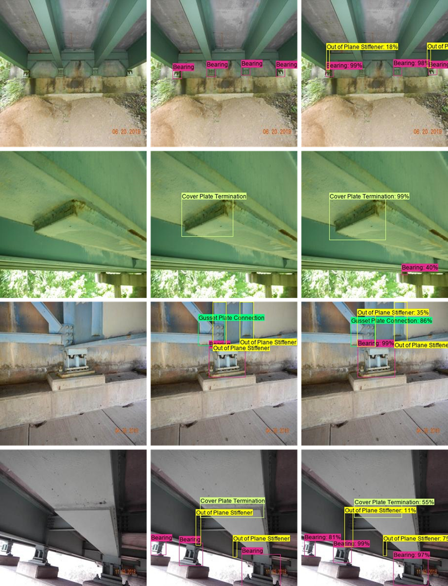

# COCO-Bridge-2021-plus

<p align="center">
    
</p>

\[[Paper]()\] \[[Dataset]()\] \[[Trained models]()\]

## Overview
- Our dataset and model was focused on the detection of typical structual components which must be check during a bridge inspection. These components are found on the underside of steel bridges. This type of detection would be beneficial to the inspection process to aid with unmanned aerial system missions as well as localizing and contextualizing elements to semi-automate bridge inspection reports or captioning. 
  
- Training (SSD): We trained a [Single Shot Detector](https://arxiv.org/abs/1512.02325) (SSD) model and a [YOLOv4](https://arxiv.org/abs/2004.10934) model. These models were chosen based on their inference speed and performance. Under the same model parameters of 25% confidence and an IoU of 50%, the SSD had a  mAP score of 50% while the YOLOv4 model was able to reach 84.52%. This repository is the SSD configuration, while the YOLOv4 repository can be found [here](https://github.com/beric7/YOLOv4_infrastructure). The drawback of the YOLOv4 model was that it was very difficult to configure, and we were only able to train and test the model in Google Colab. However, other researchers and interested people are welcome to try to get it running on your local machines!

- Testing (SSD): We implemented several testing scripts. In general we utilized a script to make predictions, and output the results in text and csv file format. Those predictions are then compared to ground truth annotations and we are able to get the mAP scores for different confidence and IoU thresholds. We can visualize and save the predictions made by the trained model, as well as view the ground truth predictions overlayed on the images. 

- Visulization (SSD): We can concatenate the results from the predictions, ground truth labels, and base images for a visual summery of the performance.  

## Results 

## References
### Papers
- [COCO-Bridge-2021](https://doi.org/10.1061/(ASCE)CP.1943-5487.0000949) Original paper using the COCO-Bridge-2021 dataset
- :red_circle: [Development of Open-source Collaborative Structural Inspection Datasets](structural_inspection_main/access/not_ready.png) (In review) Paper which references and introduces COCO-Bridge-2021+ dataset
### Dataset
The COCO-Bridge-2021+ dataset and information can be found [here](https:doi.org/10.7294/16624495). 
**Please cite both the dataset and the journal article if you are using it.** 
The four object classes in the dataset are:
```
Bearing
Out of Plane Stiffener
Gusset Plate Connection
Cover Plate Termination
```
### Model
The trained model weights and information can be found [here](https://doi.org/10.7294/16625095.v1). 
**Please cite both the model and the journal article if you are using it.** 
## Requirements
The most important environment configurations are the following:
- Tensorflow == 1.10.0
- Python == 3.6
- 
## Evaluating Trained SSD Model
- Download the SSD/YOLOv4 [Trained Models](https://doi.org/10.7294/16625095.v1)
  
## Testing the Trained SSD Model

## Training with the COCO-Bridge-2021+ dataset
- Clone the repository
- Download the [Dataset](https://doi.org/10.7294/16625095.v1)

## Training with a custom dataset
1. Clone the repository


## Citation
```
hahasadf
```
